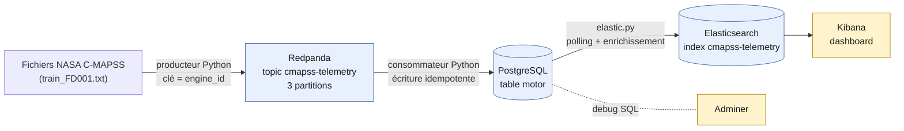

# CMAPSS Pipeline

Pipeline data engineering de bout en bout : rejeu contrôlé d'un dataset public NASA (télémétrie
moteur turbofan) via Kafka/Redpanda, écriture idempotente en PostgreSQL, SQL avancé, indexation
Elasticsearch et dashboard Kibana — le tout conteneurisé.

**Cadrage honnête** : ce projet ne fait **pas** d'acquisition en temps réel. NASA C-MAPSS est un
dataset historique, statique. Le producteur rejoue ses lignes à intervalle régulier pour simuler
un flux observable — l'intérêt du projet est de démontrer les réflexes d'un pipeline de streaming
(partitionnement, offsets, idempotence, reprise après panne), pas de prétendre à des données
réellement temps réel.

## Source

[NASA C-MAPSS — Turbofan Engine Degradation Simulation Dataset](https://data.nasa.gov/dataset/cmapss-jet-engine-simulated-data)

Sous-dataset utilisé : **FD001** (une seule condition opérationnelle, un seul mode de panne — le
plus simple pour isoler une dérive de capteur sans facteur confondant). Détails du modèle
d'événement et des clés dans [`docs/spec_evenements.md`](docs/spec_evenements.md).

## Architecture



- **Producteur** (`producer.py`) : lit un fichier C-MAPSS ligne par ligne, publie chaque cycle
  moteur en JSON dans Redpanda, avec `engine_id` comme clé de partition (garantit l'ordre des
  cycles par moteur). Dépend uniquement de `redpanda`.
- **Consommateur** (`consumer.py`) : lit le topic, écrit chaque événement dans PostgreSQL avec
  `INSERT ... ON CONFLICT (dataset, split, engine_id, cycle) DO NOTHING` — rejouer le flux ne crée
  jamais de doublon. Dépend de `db` et `redpanda`.
- **PostgreSQL** : stockage validé, requêtes SQL avancées (CTE, fonctions fenêtre) dans
  [`sql/queries.sql`](sql/queries.sql) — moyennes glissantes, dérive de capteur, comparaison de
  moteurs, phases de vie, détection d'anomalie par écart-type.
- **`elastic.py`** : interroge PostgreSQL en boucle, réutilise la requête de détection d'anomalie,
  indexe les événements enrichis dans Elasticsearch avec un mapping explicite (pas de types
  devinés). Requêtes Elasticsearch (Query DSL, pas SQL) dans
  [`elasticsearch/queries.json`](elasticsearch/queries.json).
- **Kibana** : dashboard "Santé moteur/capteurs" construit sur l'index Elasticsearch — compte
  d'anomalies par moteur et médiane de capteur dans le temps, mis à jour pendant le rejeu.
- **Adminer** : client web pour inspecter PostgreSQL pendant le développement.

## Démarrage

Prérequis : Docker Desktop (avec la virtualisation activée).

```bash
git clone https://github.com/Moulin-Charles/Pipeline-data-engineering-NASA-C-MAPSS.git
cd Pipeline-data-engineering-NASA-C-MAPSS
docker compose up --build
```

Ça démarre PostgreSQL (avec le schéma initialisé automatiquement via `sql/init.sql`), Redpanda,
Elasticsearch, Kibana, Adminer, le producteur et le consommateur. Le producteur publie
`CMAPSSData/train_FD001.txt` par défaut ; passer un autre fichier :
```bash
docker compose run --rm producer python producer.py CMAPSSData/train_FD002.txt
```

`elastic.py` n'est pas encore conteneurisé — le lancer à part (limite connue, voir plus bas) :
```bash
pip install -r requirements.txt
python elastic.py
```

Kibana : `localhost:5601`. Adminer : `localhost:8080` (serveur `db`, utilisateur `postgres`,
mot de passe `example`).

## Commandes utiles

```bash
docker compose ps -a                                    # état de tous les services
docker compose logs <service> --tail 50                 # logs d'un service
docker compose exec redpanda rpk topic list              # topics Kafka existants
docker compose exec redpanda rpk topic consume cmapss-telemetry -n 5   # voir des messages
docker compose exec redpanda rpk group describe redpanda-to-postgres   # retard du consommateur
```

## Modes de panne (testés volontairement)

**Arrêt du consommateur, puis rattrapage.** `docker compose stop consumer`, republication de
données pendant l'arrêt, redémarrage. Le compte de lignes dans PostgreSQL reste stable pendant
l'arrêt puis reprend sa progression au redémarrage (grâce à l'offset Kafka committé par consumer
group), sans perte ni doublon. Limite notée : le consommateur n'affiche aucune trace de son
activité, seule une mesure directe (compte de lignes ou `rpk group describe`) révèle le
rattrapage.

**Rejeu du même fichier — idempotence.** Republier un fichier déjà entièrement ingéré ne fait
strictement pas progresser le nombre de lignes en base : la contrainte `UNIQUE` combinée à
`ON CONFLICT DO NOTHING` absorbe les doublons.

**Arrêt de PostgreSQL en pleine ingestion.** `docker compose stop db` pendant que le consommateur
écrit activement provoque un **plantage complet** du consommateur (`Exited (1)`) :
```
psycopg2.OperationalError: server closed the connection unexpectedly
```
Cause assumée : aucune gestion d'erreur autour de l'écriture PostgreSQL — une exception non
rattrapée termine tout le script, pas seulement le message en cours. Un système de production
ajouterait une reprise automatique avec retry/backoff. Reprise testée : redémarrer PostgreSQL
puis relancer manuellement le consommateur (`docker compose start consumer`) suffit à reprendre
proprement, sans doublon, grâce à l'offset et à la contrainte d'unicité.

## Limites connues

- `elastic.py` tourne en dehors de Docker Compose — à conteneuriser pour un vrai démarrage en une
  seule commande.
- Le consommateur ne redémarre pas automatiquement après un plantage (pas de politique de
  redémarrage Docker, pas de retry applicatif).
- Le nombre de partitions du topic Kafka (3, choisi pour démontrer le partitionnement par
  `engine_id`) est configuré manuellement via `rpk`, pas dans `docker-compose.yml` — un
  `docker compose up` sur un environnement neuf recréerait un topic à une seule partition.
