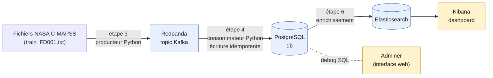

# Notes — Étape 2 : stack Docker Compose

Résumé des concepts vus pendant la mise en place de `docker-compose.yml`. Sert de mémo, pas de
spec — le raisonnement propre au projet (clés, choix de dataset) reste dans `spec_evenements.md`.

## Vue d'ensemble de l'architecture

Adminer et Kibana sont des **outils d'inspection** (pas de stockage propre) ; Redpanda, PostgreSQL
et Elasticsearch sont les trois briques qui **détiennent des données**.

## Conteneurs et Docker Compose

- Une **image** Docker est un instantané figé (filesystem + programme + config). Un **conteneur**
  est cette image en cours d'exécution — isolé, léger, jetable, reproductible.
- `docker-compose.yml` décrit plusieurs conteneurs à lancer ensemble : quelle **image**, quels
  **ports** exposer vers l'hôte, quelles **variables d'environnement**, quels **volumes** pour
  persister les données.
- Compose crée un **réseau interne automatique** entre tous les services d'un même fichier. Un
  service en joint un autre par son **nom de service** (ex: `db`, `elasticsearch`) — jamais par
  `localhost`, qui à l'intérieur d'un conteneur pointe toujours vers lui-même, pas vers ses voisins.
- `localhost` n'est valable que depuis l'**hôte** (ta machine Windows, ton navigateur), pour un
  service dont le port a été publié (`ports:`).

## `depends_on` et `healthcheck`

- `depends_on:` seul garantit uniquement que le conteneur dépendant a **démarré** — pas que le
  programme à l'intérieur est prêt à répondre.
- `condition: service_healthy` resserre cette garantie : le service qui dépend attend que le
  `healthcheck` du service ciblé ait réussi au moins une fois.
- Le lien entre les deux se fait uniquement par le **nom du service** (la clé YAML). Sans
  `healthcheck:` défini sur le service ciblé, `condition: service_healthy` est invalide.
- Plusieurs dépendances = plusieurs entrées dans la carte `depends_on:`, chacune avec son propre
  nom et sa propre condition, évaluées indépendamment.

## Les services du projet

| Service | Rôle | Stocke des données ? |
|---|---|---|
| `db` (PostgreSQL) | Base relationnelle : écriture validée et idempotente des événements, requêtes SQL avancées (étape 5) | Oui |
| `adminer` | Client web générique pour bases de données (pas spécifique à Postgres) — debug/exploration SQL manuelle | Non |
| `redpanda` | Broker compatible API Kafka : reçoit le flux publié par le producteur, le conserve en log ordonné, le met à disposition du consommateur à son rythme | Oui |
| `elasticsearch` | Indexation et recherche/agrégation rapide sur les événements enrichis (étape 6), via un index inversé | Oui |
| `kibana` | Interface web qui interroge Elasticsearch et affiche des dashboards — ne stocke rien lui-même | Non |

## Concepts Kafka/Redpanda (rappel étape 1)

- Un **topic** est un journal en ajout seul, découpé en **partitions** pour le parallélisme.
- La **clé de partition** (`engine_id` dans ce projet) garantit que tous les messages partageant
  cette clé atterrissent dans la même partition, donc dans l'ordre où ils ont été publiés. Elle n'a
  pas besoin d'être unique globalement.
- La **clé naturelle** (`dataset, split, engine_id, cycle`) sert à l'identité en base — garantir
  qu'une ligne = un événement réel, pour permettre une écriture idempotente (rejouer le flux ne
  crée pas de doublons).
- Écouteurs interne/externe (`internal://redpanda:9092`, `external://localhost:19092`) : même
  principe que `localhost` vs nom de service — l'adresse annoncée par Redpanda dépend de qui se
  connecte, depuis l'intérieur ou l'extérieur du réseau Docker.

## Décision prise

Le producteur et le consommateur (étapes 3 et 4) tourneront **dans leurs propres conteneurs**,
pas directement sur Windows — pour rester proche d'un déploiement industriel et permettre à
`docker compose up` de lancer l'ensemble du pipeline sans dépendance externe.
